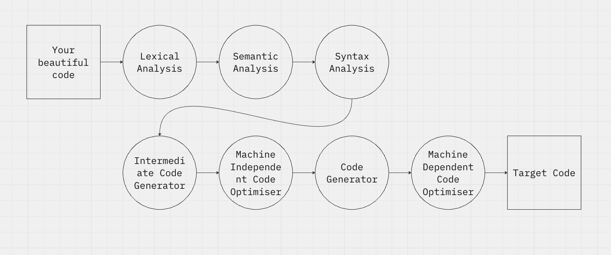

# Creating a programming language. Part 1: Lexical analysis

> A skald was a Norse poet or bard who composed and recited verses celebrating heroes and Norse gods. They used complex forms and wordplay, playing a key role in preserving Viking history, mythology, and culture.

Have you ever wanted to create your own programming language? I bet you do!.
In this series of articles, we are diving into the art of thinking, designing and implementing a programming language and its compiler.

## Introduction

Think a little about how do you run a code. First, you need to write it. And I bet you write good codes!

After writing, to execute the program, you need to compile it, because your machine cannot just understant what you wrote.

The compiler is nothing more than a big (big) program that reads your code and translates it into a code your computer understands.

:::note[Interpreter vs Compiler]
Actually, you can also *interpret* your code, like Python or Node.js. But think in a compiler as just as a program that translates program written in one language to another.
:::

A compiler is divided into several parts, and the first one is the **lexical analysis**.

## Lexical analysis - Tokenization

All programming languages has a vocabulary. This vocabulary is composed by reserved words, operators, identifiers, symbols etc.

It is like our human language. We have words and we can combine them to form another words. For example, the word "abnormal" is formed by the prefix "a-" and the word "normal". Both are lexical structures of the language.

We need first to determine what lexical structures our own language will have. But these "lexical structures" are not called like that. They are called **tokens**.

Let's define a language:

### Objective

Is your language a general-purpose language? Or is it a domain-specific language? (Mine is a general-purpose language)

Is your language comercial or experimental? (Of course ours is experimental)

### Paradigm

Here you can choose some of the following:
1. Imperative (like C, and the most easy to implement. We are going to use this one)
2. Functional (like Haskell)
3. Object-oriented (like Java)
4. Logic (like Prolog)

### Basic characteristics
1. System of types (static or dynamic)
2. Concurrent or not
3. Functional abstraction

### Level
1. Low-level (like Assembly)
2. High-level (like Python)

### Machine
1. Virtual (like Java)
2. Real (like C)
3. Hypothetical
4. Simulated

### Translational type
1. Compiled
2. Interpreted
3. Hybrid (like Java)

Check the repo:
::github{repo="Felipalds/skald"}
